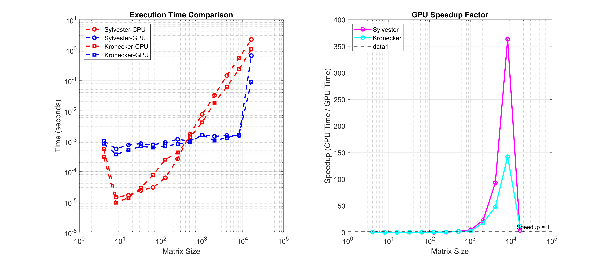

# Hadamard Single-pixel imaging

## BenchmarkCPU.m
Benchmark CPU implementations of Sylvester vs Kronecker Hadamard methods

## BenchmarkCPUvsGPU.m
Benchmark CPU vs GPU implementations of Sylvester and Kronecker methods

## BenchmarkCPUvsGPUforN.m
Benchmark CPU vs GPU for N Hadamard matrix generation
Compares Sylvester vs Kronecker methods with speedup calculation

## DifferentialMethod_Simulation.m
Computes positive/negative Hadamard transforms, their inverses, and visualizes results

## HadamardPatternGenerationLabel.m
This script demonstrates three methods to generate and visualize Hadamard patterns.

